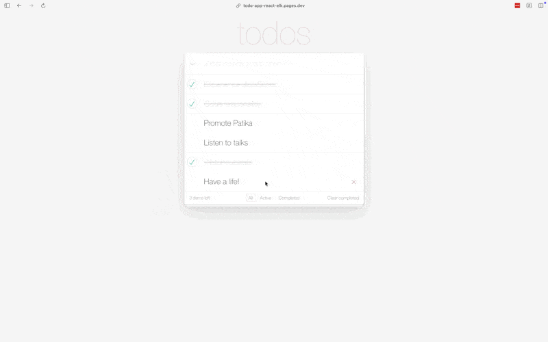

# React ToDo App

This project is a React implementation of the ToDo application by [Dmitry Sharabin](https://codepen.io/dmitrysharabin/pen/MWgQNYZ). It has been developed as part of the Patika Bootcamp Week 12 assignment. The CSS styling was imported as-is from the original project without any changes, while the rest of the application was ported to React.

## Live Demo

You can try out the live demo of the application [here](https://todo-app-react-elk.pages.dev/).

## Features

- **Add a ToDo**: Easily add new tasks to your ToDo list.
- **Edit a ToDo**: Double-click to edit an existing task.
- **Delete a ToDo**: Remove tasks from your list.
- **Complete a ToDo**: Mark tasks as completed with a simple checkbox.
- **Filter Tasks**: View tasks based on their status - All, Active, or Completed.
- **Clear Completed**: Remove all completed tasks from the list.
- **Persistent State**: ToDos are saved in the browser's local storage, so your tasks remain even after refreshing the page.

## Context API

The application uses React's Context API to manage state globally, allowing for efficient management of the ToDo list data without passing props down through many levels of components.

## Components

The application is structured into several React components:

- **App**: The main component wrapping other components and managing state.
- **Header**: Contains the input for adding new ToDos.
- **TodoList**: Renders the list of ToDo items.
- **TodoItem**: Represents each individual ToDo with options to edit and delete.
- **Footer**: Displays remaining item count and filter options.
